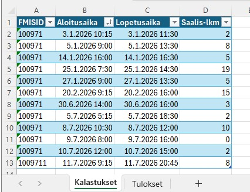
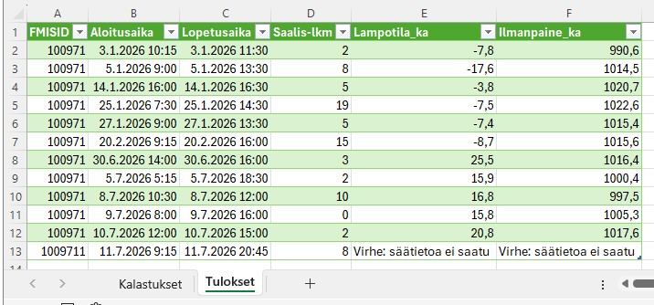

# Excel-taulukon rikastaminen säädatalla (Power Query)

## Ongelma
Kalastaja pitää Excel-taulukkoa kalapäiväkirjana, johon kirjaa jokaisesta kalastuskerrasta mm. sijainnin, kellonajat ja saalismäärän. Hän haluaisi liittää jokaiseen kirjaukseen myös kyseisen ajanjakson keskeiset säätiedot. Esimerkiksi keskilämpötilan ja -ilmanpaineen. Tietojen hakeminen käsin Ilmatieteenlaitoksen sivuilta jokaiselle riville on niin työlästä, että säätiedot jäävät usein kokonaan kirjaamatta.

## Tavoite
Automatisoida säätietojen haku ja liittäminen kalapäiväkirjaan Ilmatieteenlaitoksen avoimen datan avulla, niin että käyttäjä syöttää vain sijainnin (sääasema), saalismäärän sekä kalastuksen aloitus- ja lopetusajan. Kyseiseltä ajalta säätiedot täyttyy automaattisesti taulukkoon.

## Rajaukset
Tässä projektissa säätiedoista haetaan vain lämpötila sekä ilmanpaineen keskiarvo.

## Käytetyt teknologiat
- Microsoft Excel / Power Query (M-kieli)
- Ilmatieteenlaitoksen avoin data, WFS-rajapinta
- Claude (AI-Assisted Development)

## Työnkulku (lopullinen ratkaisu)
1. Käyttäjä lisää "Kalastukset"-taulukkoon uuden rivin: FMISID (sääasema), aloitusaika, lopetusaika ja saalis-lkm
2. Erillinen Power Query -funktio (`HaeKeskiarvo`) hakee annetulla aikavälillä havainnot Ilmatieteenlaitoksen rajapinnasta ja laskee niistä keskiarvon.
3. Toinen kysely (`KalastuksetAutomaatio`) käy koko taulukon läpi rivi riviltä ja kutsuu funktiota kahdesti per rivi – kerran lämpötilalle (t2m), kerran ilmanpaineelle (p_sea).
4. Tulos ladataan omalle "Tulokset"-välilehdelle, josta käyttäjä näkee jokaisen kalastuskerran keskilämpötilan ja -ilmanpaineen.
5. Käyttäjä päivittää tiedot napista ("Päivitä kaikki") aina lisättyään uusia rivejä.

## Projektin vaiheet ja ratkaisut
1. **Työkalun valinta ja ratkaisuarkkitehtuuri tekoälyä hyödyntäen.**  Toimin projektissa ratkaisun suunnittelijana ja hyödynsin Claude-tekoälyä teknisenä sparrauskumppanina. Asetin ratkaisulle reunaehdot (käyttäjä syöttää tiedot Exceliin) ja pyysin Claudea vertailemaan eri toteutustapoja (kuten Make.com, Google Apps Script ja Power Query) ja perustelemaan niiden hyödyt ja haitat. Tämän arvioinnin pohjalta päädyin valitsemaan Power Queryn, koska se vastasi parhaiten olemassa olevaa Excel-työskentelyä ilman erillisiä välikäsiä tai lisenssejä.
2. **Liian laaja yritys** Kokeilin ensin hakea koko vuorokauden datan yhdellä laajalla kyselyllä, jonka XML-vastaus osoittautui erittäin syvästi sisäkkäiseksi (6+ tasoa INSPIRE/GML-rakennetta). Tämä teki rakentamisesta hidasta ja virhealtista – väärän haaran klikkaaminen johti useita kertoja umpikujaan. Hakua oli vaikea hallita.
3. **Yksinkertaistus.** Lähdin yksinkertaistamaan kyselyn rakennetta. Se antoi saman tiedon paljon selkeämmässä, suoraviivaisemmassa muodossa, jolloin oikean tiedon löytäminen helpottui huomattavasti.
4. **Raakadatan testaus ennen jatkokäsittelyä.** Ennen kuin aloin laskea mitään keskiarvoja, halusin ensin varmistaa, että saan ylipäätään oikeat säätiedot oikealta ajalta näkyviin Exceliin. Tämä osoittautui hyväksi tavaksi edetä, koska pystyin tarkistamaan yksinkertaisesti silmämääräisesti, että luvut näyttivät järkeviltä, ennen kuin lisäsin monimutkaisempaa logiikkaa päälle.
5. **Staattisen haun muuttaminen dynaamiseksi:** Ensimmäinen toimiva versioni haki tiedot aina vain taulukon ensimmäiseltä riviltä, jonka takia uusien kalastuspäivien lisääminen ei tuonut niille omia säätietoja – kaikki rivit näyttivät saman, ensimmäisen rivin luvut. Piti siis muuttaa tapaa niin, että sama haku toistuu automaattisesti jokaiselle riville erikseen, sen mukaan mitkä ajat kyseiselle riville on kirjoitettu.
6. **Testaukset:** Laadin testaussuunnitelman, johon kirjasin mahdollisia skenaarioita. Testasin ne ja kirjasin mitä tapahtui.
7. **Viimeistely:** Testausten pohjalta ilmeni tilanteita, jotka kannattaa estää. Tein "Tietojen kelpoisuuden tarkastaminen" datatyökalun avulla estot/virheviestit, jotta data kirjautuu heti alussa oikein.

## Keskeiset haasteet
- **Datan muotoiluongelmat** Suomalainen Excel kirjoittaa luvut ja kellonajat eri tavalla kuin mitä säätiedot-rajapinta odotti (esim. pilkku pisteen sijaan luvuissa, piste kaksoispisteen sijaan kellonajoissa). Tämän takia sain useita virheilmoituksia, vaikka data näytti silmämääräisesti aivan oikealta.
- **Ulkoisen rajapinnan (Ilmatieteenlaitoksen säädatan) hakeminen ei ollut suoraviivaista:** Data tuli monimutkaisessa muodossa, ja jouduin useaan otteeseen yksinkertaistamaan lähestymistapaani, jotta sain siitä irti juuri ne tiedot, joita tarvitsin (lämpötila ja ilmanpaine).
- **Kiinteästä hausta joustavaan hakuun:** Ensimmäinen versioni haki tiedot aina vain taulukon ensimmäiseltä riviltä, joten uusien kalastuspäivien lisääminen ei toiminut. Jouduin rakentamaan ratkaisun uudelleen niin, että sama haku toistuu automaattisesti jokaiselle riville erikseen.
- **Tekoälyavusteinen kehittäminen (AI-Assisted Development) ja iteratiivinen ongelmanratkaisu:** En pyytänyt tekoälyltä kerralla valmista koodia, vaan pilkoin alkuperäisen liiketoimintaongelman loogisiin osiin. Kuvasin Claudelle lähtötilanteen tarkasti ja pyysin siltä vaiheittaisen ohjeistuksen automaation rakentamiseen. Kun vastaan tuli monimutkaisia virheilmoituksia (esim. päivämäärien ja lukujen muotoiluongelmissa suomalaisessa Excelissä), osasin dokumentoida ne tarkasti kuvakaappauksin ja ohjata tekoälyä korjaamaan Power Queryn M-kielistä koodia. Tämä opetti, että tekoälyavusteinen kehittäminen ei ole vain koodin kopioimista, vaan jatkuvaa promptien tarkentamista ja ratkaisun ohjaamista oikeaan suuntaan.
  
## Datan eheyden varmistaminen
Kalastukset-taulukon Aloitusaika- ja Lopetusaika-sarakkeisiin on asetettu Excelin Tietojen kelpoisuuden tarkistaminen -työkalulla seuraavat säännöt, jotka estävät virheellisen datan syöttämisen jo kirjaushetkellä.

| Sarake | Kaava | Mitä sääntö tekee | 
|---|---|---|
| Aloitusaika | `=B2<=NYT()` | Aloitusaika ei saa koskaan olla tulevaisuudessa. 
| Lopetusaika | `=TAI(C2="";JA(TAI(B2="";C2>B2);C2<=NYT()))` | Lopetusaika saa olla tyhjä. Jos se on täytetty, sen täytyy olla aloitusajan jälkeen (mikäli aloitusaika on annettu) eikä se saa olla tulevaisuudessa. | 

## Mitä opin
- **Testaa pienissä osissa**: Kannattaa testata jokainen rakennuspala (raakadatan haku, yhden rivin laskenta) erikseen ennen kuin yhdistää ne isommaksi automaatioksi – tämä paljastaa virheet paljon aikaisemmin kuin jos yrittää rakentaa koko putken kerralla.
- **Vaatimusmäärittely ja tekoälyn ohjaaminen (Prompt Engineering):** Oivallukseni oli, että tekoäly pystyy luomaan monimutkaistakin koodia ja rajapintakyselyjä, jos osaan arkkitehtinä määritellä sille tavoitteen, reunaehdot ja käytettävän datan rakenteen riittävän tarkasti.
- Tekoälyn käyttö kehitystyössä on taito siinä missä koodaaminenkin: osasin kuvata virhetilanteet tarkasti (mm. kuvakaappauksilla) ja edetä pienin askelin, mikä teki yhteistyöstä tehokasta. Jatkossa määrittelisin vielä tarkemmin alkuun projektin suunnitelmaa.
- **Käytettävyys:** Kiinnittämään huomiota siihen, että jo kirjausvaiheessa data kirjataan oikein. Excelin työkalulla "Tietojen kelpoisuuden tarkastaminen" pystyy asettamaan ehtoja, jotta kirjaukset menee oikein.

## Kuvakaappaukset
**Kalastukset-taulukko** – käyttäjän syöttämä lähtödata (FMISID, aloitus- ja lopetusaika, saalismäärä):

**Tulokset-taulukko** – automaattisesti täydentyneet lämpötila- ja ilmanpainekeskiarvot:

